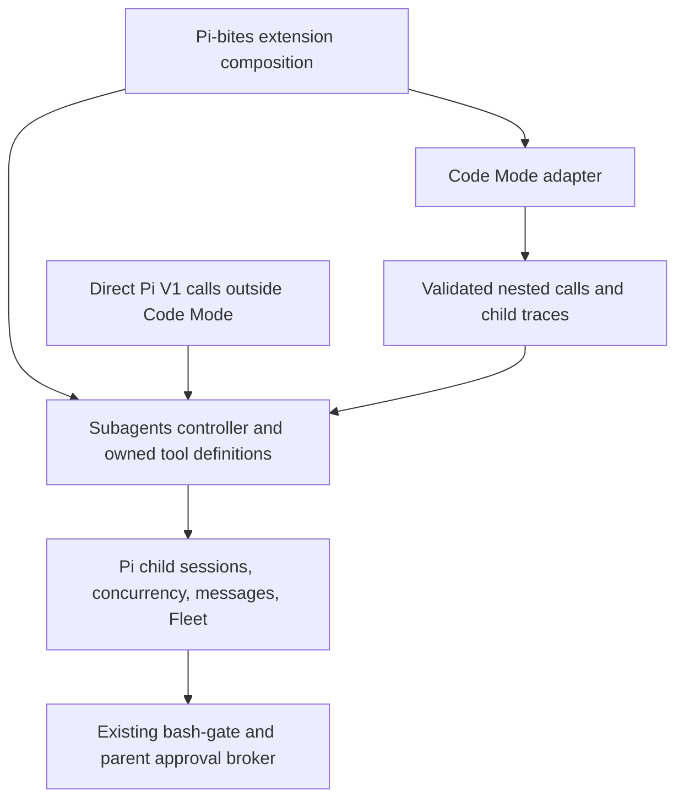

# Subagents and Code Mode: reassessing #264

Research date: 2026-09-12. Proposal for discussion, not an accepted contract or an implementation. GitHub issues and bookmarks were inspected without modifying them.

## Confirmed direction and parity boundary

Maintainer clarification, 2026-09-12: subagent tools must remain available as standalone tools outside GPT-5.6/GPT-6 Code Mode, and become nested capabilities when those models use Code Mode. Their meaningful behavior should match Codex one for one. Internal mechanisms such as message encryption are not a migration objective. This records a scope exclusion, not a verified claim that Codex encrypts inter-agent messages.

Use one subagent engine with two exposure paths:

| Session configuration                              | Subagent exposure                                      |
| -------------------------------------------------- | ------------------------------------------------------ |
| Eligible GPT-5.6/GPT-6 model with Code Mode active | Nested functions; no duplicate direct subagent surface |
| Other model, or Code Mode adapter disabled         | Standalone Pi tools with the same behavior             |
| Subagents disabled                                 | Neither surface                                        |

Each child session applies exposure according to its own model and enabled capabilities. Switching the parent's exposure must preserve established agent identities and provide usable controls through the new surface.

Parity means observable contracts and orchestration semantics: argument names/defaults, successful outputs and errors, history inheritance, roles and model inheritance, caller/target relationships, message delivery and interruption, wait behavior, completion notifications, capacity reservation, close/resume, descendant handling, and cancellation boundaries. Exercise the same lifecycle scenarios through both direct and nested calls. Existing Pi behavior is not an automatic exception merely because it is already implemented; differences need a concrete platform reason and documentation.

Implementation details may differ when those semantics survive: Pi session storage, in-process communication, serialization internals, and UI components need not reproduce Codex internals. Preserve Pi's existing authorization and provider boundaries. This scope does not introduce inter-agent encryption, Codex backend infrastructure, or custom providers.

The recommended public contract remains V1, matching the existing migration. Choosing V2 would still require an explicit revision of the operation set and lifecycle plan; the confirmed exposure requirement alone does not select V2.

## Recommendation

Finish the existing V1 migration and expose that owned capability through Code Mode for supported GPT-5.6/GPT-6 models. Keep the same five V1 operations as ordinary Pi tools outside Code Mode. Keep agent sessions, concurrency, messaging, approvals, and Fleet in `subagents/`; let `codex-adapter/` own only their Code Mode exposure, dispatch adaptation, and nested presentation.

This follows an upstream-supported V1 integration path. It does **not** reproduce current Codex's default V2 surface: that newer family defaults to direct model calls outside Code Mode. Adopting V2 would be a separate contract decision, not a prerequisite to nesting V1.

Treat #294 as the foundation and #264 as the subsequent integration. Do not reopen the completed five-tool cutover or fold the unfinished subagent migration into its acceptance criteria.

## Inspected state

| Source                          | Baseline                                                                       |
| ------------------------------- | ------------------------------------------------------------------------------ |
| Current Code Mode branch        | `8f3d622f`, bookmark `codex-code-mode`; working copy initially empty           |
| Subagent integration bookmark   | **`subagents-codex`**, `251c3f5f`                                              |
| Subsequent wait implementation  | `4dfaa319`, `feat(subagents): replace WaitAgent with wait_agent`               |
| Subsequent close implementation | `31a50c3f`, `feat(subagents): add close_agent lifecycle`                       |
| Latest inspected descendant     | `509be8df49bff7432e286e20688764eaf8a8ada2`, untitled close/lifecycle follow-up |
| Existing subagent contract pin  | Codex `ddf8a67ab09cd76b8adc0969f11ee1271179aba7`                               |
| Code Mode contract/host pin     | Codex `25af12f7e61572b0bc18ddb1008be543b91519b0` (`rust-v0.145.0`)             |
| Local Codex checkout            | `a62e98d18c6550e3bea152ed1b89d1e931dca961`                                     |
| Installed Pi documentation      | 0.85.1                                                                         |

GitHub reports #271–#275 closed and #276–#278 open. The local bookmark stops before the closed #275 implementation; the descendant commits contain work beyond the bookmark. Preserve and review those descendants when continuing the integration. The branches share earlier ancestry, but the subagent branch still has pre-cutover adapter/RTK wiring: integrate the subagent changes onto the finished Code Mode base without reviving that obsolete wiring.

Sources: [epic #264](https://github.com/jamestrew/pi-bites/issues/264), [close #276](https://github.com/jamestrew/pi-bites/issues/276), [resume #277](https://github.com/jamestrew/pi-bites/issues/277), [audit #278](https://github.com/jamestrew/pi-bites/issues/278), local `jj log -r 'ancestors(subagents-codex, 8) | descendants(subagents-codex)'`, and [latest descendant](https://github.com/jamestrew/pi-bites/commit/509be8df49bff7432e286e20688764eaf8a8ada2). Local commit links may be unavailable remotely until published; use `jj file show -r 509be8df <path>` to reproduce inspection.

## What is reusable, and what is unfinished

The work already provides the V1 contract baseline, retained sessions, open-agent concurrency reservations, immediate capacity errors for model spawns, `spawn_agent`, `send_input`, independent wait/final-notification delivery, and substantial close/subtree/tombstone handling. This is useful infrastructure even if the exposure changes.

The following are substantive unfinished or contradictory requirements, not tool renames:

- **Child collaboration:** `agent-runner.ts` excludes collaboration tools and installs the old `MessageAgent` parent helper. `packages/ext/index.ts` returns before subagent registration inside child sessions. A parent-only wrapper would leave the child contract unchanged. Decide how V1 parent messaging and authorized nested spawning reach the same session tree, with shared limits and correct caller identity.
- **Explorer policy:** the epic says guidance only; `CODEX_V1.md`, `default-agents.ts`, and #278 retain a read-only explorer adaptation. Choose one and align role configuration, allowed capabilities, bash policy, and prompts. For upstream fidelity, prefer guidance-only roles with the parent's actual permissions still authoritative. Code Mode must never bypass a retained role restriction by exposing an otherwise excluded nested tool.
- **Resume that works:** children are created with `SessionManager.inMemory`. Close records them as unrecoverable after disposal. #277 permits that error, but exposing a normal `resume_agent` that fails for every ordinary closed child would not fulfill the intended reusable-agent workflow. Provide manager-owned persistence or another explicit recoverable conversation representation before promising close/resume parity.
- **Resume capacity:** #277 says reserve only when the next turn starts. Upstream V1 reserves during resume, before reopening, and commits the reservation without starting user work. This matches the epic's rule that open agents hold capacity. Correct #277 or record a deliberate deviation.
- **Errors:** spawn/send/wait sometimes encode failure in display details and text rather than throwing. A nested bridge must classify those results and reject failed calls, not return success-shaped values or attempt to parse arbitrary error prose as JSON.
- **Pins and prompts:** the subagent baseline and Code Mode baseline are different revisions. Reconcile against the chosen common contract revision, document necessary differences, and separate tool definitions from broader orchestration/model prompts.

Local evidence at `509be8df`: `packages/ext/subagents/{CODEX_V1.md,codex-v1-contract.ts,default-agents.ts,agent-runner.ts,agent-close.ts,agent-manager.ts,agent-tool-execute.ts,register-send-input.ts,register-wait-agent.ts}` and `packages/ext/index.ts`. Resume source comparison covers all three Codex revisions: `codex-rs/core/src/agent/control/spawn.rs` (checkout lines 1243 and 1285; old subagent pin lines 1205 and 1247; host pin lines 854 and 894).

## Upstream integration choices

V1 and V2 are separate public contracts. Code Mode eligibility is another independent choice. Current Codex's V2 configuration defaults `non_code_mode_only` to true; V1 can be nested, and uses deferred exposure when tool search is supported. Setting V2's flag false permits its nesting. Therefore “match current Codex” alone is insufficient to select a surface.

| Direction                                  | Consequence                                                                                               |
| ------------------------------------------ | --------------------------------------------------------------------------------------------------------- |
| Finish V1 and nest it                      | Reuses the current migration and satisfies the requested Code Mode composition; recommended bounded scope |
| Adopt V2 with its current default exposure | Changes orchestration contracts and keeps collaboration direct; does not achieve the requested nesting    |
| Adopt V2 and opt into nesting              | Changes contracts and exposure together; broader replacement project requiring a fresh delivery plan      |

For a nested V1 implementation, distinguish `wait_agent` (observe agent status) from outer `wait` (resume a JavaScript cell). Discovery, waiting, asynchronous child delivery, and UI traces remain separate mechanisms. See the upstream evidence supplement below for exact source paths and exposure details.

## Proposed integration boundary



Use the existing composition root in [packages/ext/index.ts](../../packages/ext/index.ts). Construct a subagent capability/controller and inject it into Code Mode registration; split construction and registration if needed to preserve lifecycle ordering. Do not discover executors through `getAllTools()`, which returns metadata, or introduce a generic third-party interception layer. The existing global manager and event RPC need not become the model-facing dispatch path.

Refactor subagent registration to return owned definitions and shared operations. Both ordinary Pi execution and nested dispatch must use the same validation, role/model resolution, manager methods, output contracts, and renderer state. Subagent code should not import or require the adapter at runtime.

The current adapter has several explicit five-tool boundaries: [activation.ts](../../packages/ext/codex-adapter/activation.ts), [contracts.ts](../../packages/ext/codex-adapter/code-mode/contracts.ts), [nested-adapters.ts](../../packages/ext/codex-adapter/code-mode/nested-adapters.ts), [nested-tools.ts](../../packages/ext/codex-adapter/code-mode/nested-tools.ts), and [rendering.ts](../../packages/ext/codex-adapter/code-mode/rendering.ts). Extend those through an owned capability bundle, including definitions, exposure, execution, availability, and renderers. The standalone runtime already delegates registered functions; nesting five more owned functions does not itself require a new host or Rust agent runtime.

The current bridge's reduced `ToolExecutionContext` is insufficient for spawn. Parent session identity, conversation entries for a fork, system prompt, model/provider data, and policy dependencies must be captured by subagents while context is active. Deferred calls receive stable snapshots and generation-bound capabilities. They must never dereference a captured Pi `ctx`; snapshots also need lifecycle invalidation so stale but nonthrowing objects cannot act on an old session.

Pi sources: installed [extensions.md](/nix/store/1dp98a4mcph9wmb2jmc20h8qvjbnryys-pi-0.85.1/libexec/pi/docs/extensions.md), “Tool Definition,” “Sending Messages,” and `getAllTools`; current [parent-snapshot.ts](../../packages/ext/subagents/parent-snapshot.ts). Pi 0.85.1 documentation distinguishes partial UI updates from final model content and describes steering at the next model boundary. No immediate injection into an ongoing inference is promised.

## Exposure and output policy

- Within supported Code Mode scope, expose one nested V1 surface; remove its duplicate direct exposure. Outside scope or with the adapter disabled, expose the same five operations as ordinary Pi tools. Disabling subagents removes both surfaces. Preserve unrelated tools and explicit selections.
- Prefer native namespace-derived V1 names if mirroring upstream literally; a flat `tools.spawn_agent` alias would be a documented Pi adaptation. Do not silently mix naming conventions between descriptions, `ALL_TOOLS`, schemas, and dispatcher lookup.
- Use the existing `ALL_TOOLS` mechanism for complete declaration-bearing collaboration help. Keep a short initial capability/discovery cue and any policy needed before choosing to discover or delegate. Do not require Responses tool search. Deferring V1 on all supported Pi routes is a local exposure choice where upstream would instead use eager exposure.
- Return the V1 JSON payload as a JavaScript object, with its output schema available in generated declarations. Keep Fleet metadata and renderer details out of that object. Failed calls reject; native cell finalization semantics remain authoritative.
- Replace the 2,000-token target as the sole acceptance measure with separate measurements for initial eager instructions, full discoverable declarations, discovery output, and actual provider payloads. The existing 2,902 estimate is `ceil(characters / 4)`, not measured provider tokens. Do not shorten pinned descriptions merely to meet a budget; account for deferred help once it enters history.

## Lifetimes and cancellation to specify explicitly

An agent belongs to the owning conversation/session tree, not to the JavaScript cell that spawned it. A successful spawn must survive normal cell completion. Cancelling an agent wait removes that waiter; it does not imply closing the child. Cell finalization cancels unfinished delegates and is not a transaction that rolls back successful agent operations.

Reject already-cancelled requests before reserving capacity or submitting input. Cover cancellation racing initialization: a committed child must remain discoverable and manageable even if its result cannot reach the cancelled caller. If an operation has not committed, prevent late creation/submission after its generation is invalidated. Define this boundary in the controller rather than assuming aborting the host promise undoes side effects.

Keep agent ownership separate from the adapter's existing `ownShell` cell ownership. On leaving Code Mode, clear cells as today, restore direct V1 controls, and preserve valid session-owned agents. On parent session replacement, branch navigation, reload, or shutdown, follow an explicit subagent lifecycle policy that prevents orphaned work, stale approvals, or delivery into another conversation. Persisted transcripts restore display and recoverable conversation data only through explicit agent reopening; they do not restore live host cells, processes, or authorization.

An asynchronous final notification and an explicit `wait_agent` result may report the same final status by contract. A nested renderer trace is neither of those delivery channels. Reuse the subagent renderers inside enclosing `exec`/`wait` rows, with call IDs, progress, failure, restored details, and collapsed/expanded behavior covered. Maintain Fleet and conversation navigation without manufacturing duplicate Pi tool messages.

## Suggested revision to the issue plan

Proposed epic title: **Integrate Codex V1 subagents with scoped Code Mode**.

Proposed goal: complete the existing V1 collaboration lifecycle in `subagents/`, expose it through Code Mode on the adapter's eligible models and directly elsewhere, and preserve shared session ownership, command authorization, delivery, and recognizable nested activity.

1. **Amend the contract baseline.** Select one model-facing revision (prefer the existing Code Mode pin after verifying its V1 differences), settle roles, naming, resume storage/capacity, child delegation, and documented platform deviations. Leave the host pinned unless runtime requirements demand a separately justified upgrade.
2. **Finish #276 and revise #277.** Retain the close implementation and follow-up commits; make normal close/resume useful and capacity-consistent. Review existing tests on the combined base.
3. **Add an owned subagent capability boundary.** Extract shared operations and render definitions, lifecycle snapshots, caller/session identity, and cancellation handling. Preserve direct functionality while this seam is developed.
4. **Add nested dispatch and exposure.** Wire the capability at the composition root, generate complete metadata, support discovery, preserve disabled/unsupported fallbacks, and classify failures correctly. Include children and their parent-message path in the exposure audit.
5. **Add nested presentation and lifecycle integration checks.** Preserve Fleet, approval escalation, child notifications, and restored trace rendering. Verify the three lifetimes: agent, cell, and shell session.
6. **Expand #278 into the combined final audit.** Remove obsolete names in parent and children; verify all five tools on actual GPT-5.6/GPT-6 routes plus an unsupported-model fallback; measure initial and discovered contracts; run `bun check` and record unavailable smoke routes.

Revise #264's “do not make this part of codex-adapter” constraint to “keep the subagent engine independent; permit an explicit adapter integration.” Revise #278's no-adapter-dependency language the same way. Keep V2, custom providers, generic tool interception, and Responses-only input items out of scope unless deliberately selected. Preserve additive Pi/project/skill prompts instead of importing an entire Codex model template.

Acceptance should include parallel capacity exhaustion, send interruption and reuse, close/resume, child-to-parent messaging, selected-target waits, cancellation races, failed nested calls, session/branch/reload boundaries, role/tool restrictions, supported-model switches, adapter/subagent disables, Auto Mode/human escalation, stale-ctx throwing getters, and restored rendering. No unit tests solely for descriptions or prompts are needed.

## Validation

This investigation reviews source and issue state; it does not certify the unfinished subagent branch, merge it, or exercise a live model route. `bun check` passed on the current Code Mode working copy with this research note: lint, formatting, type checking, 1,342 package tests (4 skipped), and 89 additional script/native-runtime checks. The initial sandboxed run failed on restricted sockets/repository access; the full rerun outside the sandbox passed. No implementation files were changed.

## Upstream evidence supplement

All checkout links in this section pin `a62e98d18c6550e3bea152ed1b89d1e931dca961`; observations of other revisions are identified explicitly. Sources were read from the local checkout and its Git objects.

### V1 and V2 exposure are different

`MultiAgentV2Config` defaults its namespace to `collaboration` and `non_code_mode_only` to true. The tool planner translates this to `DirectModelOnly`, excluding these tools from nested execution. Setting it false yields ordinary `Direct` tools, which can be nested. V1 instead becomes `Deferred` when tool search is enabled and `Direct` otherwise. The planner selects one family, not both. Sources: [configuration](https://github.com/openai/codex/blob/a62e98d18c6550e3bea152ed1b89d1e931dca961/codex-rs/core/src/config/mod.rs#L1314), [registration](https://github.com/openai/codex/blob/a62e98d18c6550e3bea152ed1b89d1e931dca961/codex-rs/core/src/tools/spec_plan.rs#L1285), [exposure semantics](https://github.com/openai/codex/blob/a62e98d18c6550e3bea152ed1b89d1e931dca961/codex-rs/tools/src/tool_executor.rs#L68), [family selection test](https://github.com/openai/codex/blob/a62e98d18c6550e3bea152ed1b89d1e931dca961/codex-rs/core/src/tools/spec_plan_tests.rs#L2666).

The exact V1 JavaScript names at all three inspected pins are:

```js
tools.multi_agent_v1__spawn_agent;
tools.multi_agent_v1__send_input;
tools.multi_agent_v1__wait_agent;
tools.multi_agent_v1__resume_agent;
tools.multi_agent_v1__close_agent;
```

The namespace-to-JavaScript conversion uses `__`. V2, when explicitly nestable with its default namespace, similarly yields `tools.collaboration__spawn_agent` and related names. Our standalone bridge currently uses unnamespaced registrations and rejects incoming namespace fields; adopting literal namespaced definitions requires corresponding contract/protocol/lookup support, not just changing prose. Sources: [V1 specs](https://github.com/openai/codex/blob/a62e98d18c6550e3bea152ed1b89d1e931dca961/codex-rs/core/src/tools/handlers/multi_agents_spec.rs#L14), [alias conversion](https://github.com/openai/codex/blob/a62e98d18c6550e3bea152ed1b89d1e931dca961/codex-rs/tools/src/code_mode.rs#L180), local [delegates.ts](../../packages/ext/codex-adapter/code-mode/delegates.ts).

V2 exposes `spawn_agent`, `send_message`, `followup_task`, optional `wait_agent`, `interrupt_agent`, and `list_agents`. `send_message` does not start an idle agent; `followup_task` does. Task paths supply addressing. V2 spawn uses `fork_turns` (default all; none/all/positive integer string), while V1 uses boolean `fork_context` (default no fork). V2 wait observes mailbox/input activity and returns a summary; V1 wait observes selected targets and returns final statuses. These differences require lifecycle and messaging changes, not aliases. Sources: [V2 registration](https://github.com/openai/codex/blob/a62e98d18c6550e3bea152ed1b89d1e931dca961/codex-rs/core/src/tools/spec_plan.rs#L1285), [messaging specifications](https://github.com/openai/codex/blob/a62e98d18c6550e3bea152ed1b89d1e931dca961/codex-rs/core/src/tools/handlers/multi_agents_spec.rs#L181), [fork specification](https://github.com/openai/codex/blob/a62e98d18c6550e3bea152ed1b89d1e931dca961/codex-rs/core/src/tools/handlers/multi_agents_spec.rs#L581), [V2 wait handler](https://github.com/openai/codex/blob/a62e98d18c6550e3bea152ed1b89d1e931dca961/codex-rs/core/src/tools/handlers/multi_agents_v2/wait.rs#L42).

### Shared execution, structured output, session ownership

Code Mode routes nested calls through the ordinary tool runtime with a unique call ID, a Code Mode source tag, and a cancellation token. Agent execution stays outside V8. Native agent outputs implement `code_mode_result` using `serde_json::to_value`; direct transcript serialization is separate. A nested spawn returns an object with `agent_id`, not a text block requiring `JSON.parse`. Sources: [nested invocation](https://github.com/openai/codex/blob/a62e98d18c6550e3bea152ed1b89d1e931dca961/codex-rs/core/src/tools/code_mode/mod.rs#L342), [output conversion](https://github.com/openai/codex/blob/a62e98d18c6550e3bea152ed1b89d1e931dca961/codex-rs/core/src/tools/handlers/multi_agents_common.rs#L62).

Spawn passes parent thread/turn identity into agent control, without a cell owner. The generic tool runtime cancels unfinished invocation handlers; that is distinct from closing an established agent. Inspection does not establish atomic rollback when cancellation lands between child registration and handler response. Sources: [V1 spawn](https://github.com/openai/codex/blob/a62e98d18c6550e3bea152ed1b89d1e931dca961/codex-rs/core/src/tools/handlers/multi_agents/spawn.rs#L111), [runtime cancellation](https://github.com/openai/codex/blob/a62e98d18c6550e3bea152ed1b89d1e931dca961/codex-rs/core/src/tools/parallel.rs#L175).

Resume reserves capacity before loading the agent and commits it after loading. This holds at the checkout, old subagent pin, and host pin. Sources: [checkout reservation](https://github.com/openai/codex/blob/a62e98d18c6550e3bea152ed1b89d1e931dca961/codex-rs/core/src/agent/control/spawn.rs#L1243), [checkout commit](https://github.com/openai/codex/blob/a62e98d18c6550e3bea152ed1b89d1e931dca961/codex-rs/core/src/agent/control/spawn.rs#L1285), [old subagent pin](https://github.com/openai/codex/blob/ddf8a67ab09cd76b8adc0969f11ee1271179aba7/codex-rs/core/src/agent/control/spawn.rs#L1205), [host pin](https://github.com/openai/codex/blob/25af12f7e61572b0bc18ddb1008be543b91519b0/codex-rs/core/src/agent/control/spawn.rs#L854).

### Contract pin choice has observable consequences

The host pin's V1 spawn exposes `service_tier`; both the old subagent pin and current checkout omit it. Selecting the host pin for one common definition baseline therefore requires an explicit omission if Pi cannot honor that override. Tool prompts also differ across these revisions. Do not copy current checkout wording while claiming parity to an older pin. Source: compare [host-pin specs](https://github.com/openai/codex/blob/25af12f7e61572b0bc18ddb1008be543b91519b0/codex-rs/core/src/tools/handlers/multi_agents_spec.rs), [old subagent specs](https://github.com/openai/codex/blob/ddf8a67ab09cd76b8adc0969f11ee1271179aba7/codex-rs/core/src/tools/handlers/multi_agents_spec.rs), and [checkout specs](https://github.com/openai/codex/blob/a62e98d18c6550e3bea152ed1b89d1e931dca961/codex-rs/core/src/tools/handlers/multi_agents_spec.rs).

Role instructions and usage hints are separate developer fragments. Spawn inherits effective parent configuration and layers role settings; tool nesting does not require importing the complete Codex prompt system. Sources: [role instructions](https://github.com/openai/codex/blob/a62e98d18c6550e3bea152ed1b89d1e931dca961/codex-rs/core/src/context/multi_agent_role_instructions.rs#L25), [usage hints](https://github.com/openai/codex/blob/a62e98d18c6550e3bea152ed1b89d1e931dca961/codex-rs/core/src/context/multi_agent_usage_hint.rs#L19), [spawn configuration](https://github.com/openai/codex/blob/a62e98d18c6550e3bea152ed1b89d1e931dca961/codex-rs/core/src/tools/handlers/multi_agents/spawn.rs#L90).
